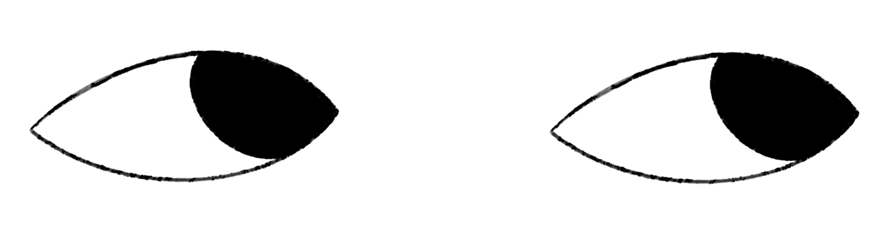

<a name="readme-top"></a>
<!--
*** Thanks for checking out the Best-README-Template. If you have a suggestion
*** that would make this better, please fork the repo and create a pull request
*** or simply open an issue with the tag "enhancement".
*** Don't forget to give the project a star!
*** Thanks again! Now go create something AMAZING! :D
-->

<!-- PROJECT LOGO -->
<br />
<div align="center">
  <a href="https://i464250.luna.fhict.nl/">
    
  </a>

  <h3 align="center">Showcase Portfolio Soulaiman Meskini</h3>

  <p align="center">
    A Personal Portfolio Website: Discover My Identity, Projects, and Work Highlights!
    <br />
    <a href="https://i464250.luna.fhict.nl/"><strong>See portfolio Website »</strong></a>
    <br />
    <br />
  </p>
</div>

<!-- ABOUT THE PROJECT -->
## About The Project

In an effort to display my abilities, work, and personal brand, I've crafted a Showcase Portfolio website. This platform not only highlights my expertise in UX/UI design and coding but also serves as a dynamic space to impress and attract future business or conections.

Here's why this website stands out:

* Demonstrates Versatility: It showcases a broad spectrum of my skills, from innovative UX/UI design to sophisticated coding, illustrating my comprehensive approach to projects.

* Professional Engagement: The website acts as a bridge for potential conections and businesses to understand my capabilities and envision how we might collaborate on future projects.

* Continuous Evolution: As my portfolio of projects expands, the website will be regularly updated to reflect new work, ensuring it remains an accurate representation of my growing skill set and achievements.

By continuously updating the site with newer projects, I aim to keep it fresh and relevant, ensuring that it serves as an effective tool for showcasing my professional journey and attracting opportunities.

<p align="right">(<a href="#readme-top">back to top</a>)</p>

### Built With

The development and design of this portfolio website were made possible through the utilization of the following robust tools and technologies:

IDEs/Editors :
*  Developed with Visual Studio Code.

Languages :

*  Structured with HTML5,

*  styled using CSS3,

*  and dynamically interacted with through JavaScript.

Frameworks :
*  Managed dependencies with PNPM

*  Built on the Node.js runtime environment.

*  Coded with React.

*  Bundled and optimized with Vite.

*  Navigated with React Router.

Libraries :

*  Enhanced animations with Framer Motion.

*  Styled with the CSS framework TailwindCSS.

*  Icons provided by React Icons for visual enhancement

Artificial Intelligence :

*  Leveraged ChatGPT for assistance.

Browser used :
 *  Preferred Browser for Testing

CI used :

*  Continuous Integration and Deployment facilitated by GitLab CI.

Design tool :

*  UI/UX designs prototyped with Figma.

Developer/Forums :

*  Inspiration drawn from CodePen.

*  Debugging on Stack Overflow.

Hosting: 

*  Deployed on Vercel

<p align="right">(<a href="#readme-top">back to top</a>)</p>

<!-- GETTING STARTED -->
## Installation

Here’s how you can set up your local development environment. This project doesn’t rely for now on any external dependencies or services, except for any APIs you choose to integrate.

### 1. Clone the repository

To get started with the project, clone the repository to your local machine:
  ```sh
  git clone https://https://git.fhict.nl/I464250/porfolio-2024
  ```
### 2. Install dependencies

Navigate to the project directory and install the required dependencies using pnpm:
   ```sh
   cd Project-Name
   pnpm install
   ```
### 3. API Comming soon!
```sh
   echo "REACT_APP_API_KEY=YOUR_API_KEY" > .env
   ```
### 4. Start the development server
Start the local development server using Vite, which should open the project in your default web browser. If not, visit http://localhost:3000 manually.
```sh
   pnpm run dev
   ```
The porfolio project should now be up and running!

<!-- USAGE EXAMPLES -->
## Usage

The website is designed to guide you through the portfolio website, which includes sections like 'About Me', 'Lookbook', and 'Projects'. Each section is designed to showcase different aspects of my work and who I am.

<p align="right">(<a href="#readme-top">back to top</a>)</p>

<!-- ROADMAP -->
## Roadmap

- [x] React project 
- [x] React Router
- [x] Multiable pages
- [x] Header
- [x] React -> React Vite
- [x] Styled components -> TailwindCSS
- [x] PDF CV made 
- [ ] Favicon
- [ ] [Figma clickable](https://www.figma.com/file/your_figma_file_link)
- [ ] Eyes component
    - [x] following cursor
    - [ ] responsive
    - [ ] drawing with the eyes
    - [ ] bug fixes  
- [ ] About Me page
    - [x] scrolling sections
    - [x] content information
    - [ ] Cv downloadable 
    - [ ] updated layout ( more spacing)
    - [ ] contact page functional
    - [ ] bug fixes
- [ ] Lookbook page
    - [x] images 
    - [ ] Firebase Img gallery
    - [ ] Anitmation
- [ ] Projects page 
    - [ ] Sections added
    - [ ] Projects content
- [ ] Animations
    - [ ] SVG logo animations
    - [x] fade in fade out 
    - [x] page loader
    - [ ] lookbook img animations (optional)

<!-- CONTACT -->
## Contact

Soulaiman Meskini - [@Fontys mail](s.meskini@student.fontys.nl
) - soulaimanmeskini@gmail.com

Project Link: [Gitlab](https://git.fhict.nl/I464250/porfolio-2024)

<p align="right">(<a href="#readme-top">back to top</a>)</p>

<!-- ACKNOWLEDGMENTS -->
## Acknowledgments

This section is to acknowledge resources and inspiration that helped me build the project.

* [Youtube playlist](https://www.youtube.com/playlist?list=PLzfUZSu68nNyIHkZhS51bP7aAY4XhtkOB&jct=pDwNQawO9jbrson9UW41ETcE-keyxg)
* [Font Awesome](https://fontawesome.com)
* [React Icons](https://react-icons.github.io/react-icons/search)
* [Framer motion](https://www.framer.com/motion/examples/)
* [TailwindCSS](https://tailwindcss.com/docs/border-radius)
* [Buildinamsterdam](https://www.buildinamsterdam.com/cases)

<p align="right">(<a href="#readme-top">back to top</a>)</p>


